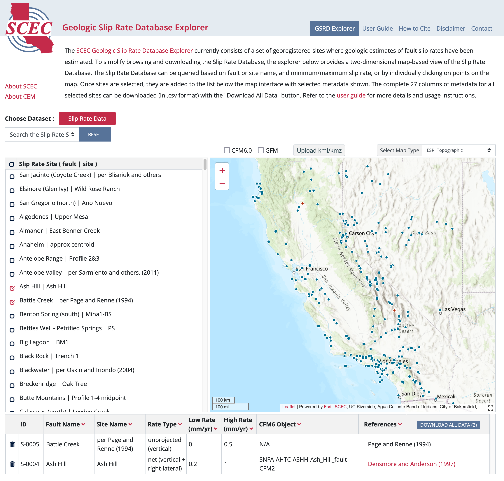

# Earthquake Geology Database

### https://www.scec.org/research/gsrd

## Geologic Slip Rate Database Explorer

A 2D web tool based on Leaflet, an open-source JavaScript library for interactive maps,
https://leafletjs.com, map data services from OpenStreetMap, https://www.openstreetmap.org,
OpenTopoMap, https://www.opentopomap.org and leaflet esri plugin,
https://esri.github.io/esri-leaflet, for Ersi basemap from ArcGIS and the GSRD 
from https://www.scec.org/research/gsrd.

### Screen Capture

Website URL: https://www.scec.org/research/gsrd-explorer/

## GSRD data service

Software stack at the backend server node when postgres and postgis are
being built from source:

- git
- gcc
- readline-develp
- zlib-devel
- json-c
- autoconf
- libxml2-devel
- libtool
- postgres version a10.5
 - proj5
 - gdal
- postgis version 2.5.1
- apache web server

### Deployment

Deployment is accomplished using [Docker](https://docs.docker.com/) with [docker-compose]([https://docs.docker.com/compose/). Clone the git repository and run the commands below for development or production deployment.

#### Development Deployment
1. Run: `docker-compose -f docker-compose.yml -f development.yml up -d`
2. After the build is complete, browse to http://localhost:8083
3. The development.yml maps the code directory to the container for easy code development and exposes port 5432 for directly accessing the Postgres database.

#### Production Deployment
1. Run: `docker-compose -f docker-compose.yml up -d`
2. After build is complete, browse to http://server-name:8083
3. Optionally, set up a reverse proxy from a URL on an existing web server to localhost:8083.

### Layout 

Server Side 
       
    Postgres/Postgis database
    PHP scripts for accessing database
    Apache web service to manage incoming
       and outgoing instruction/data

Client Side 

    JS scripts to process and manage data product
    Html web page for graphics display and user dashboard
